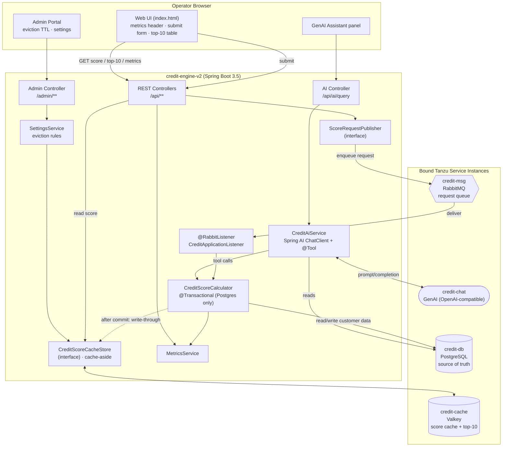
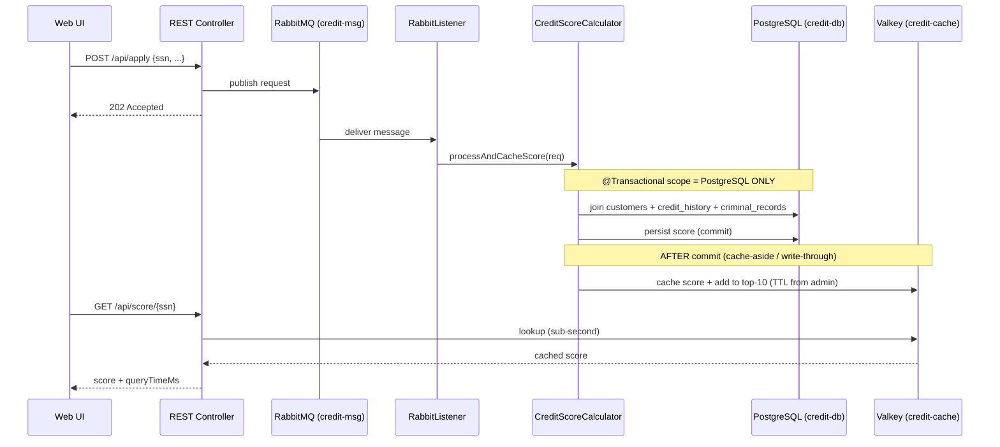
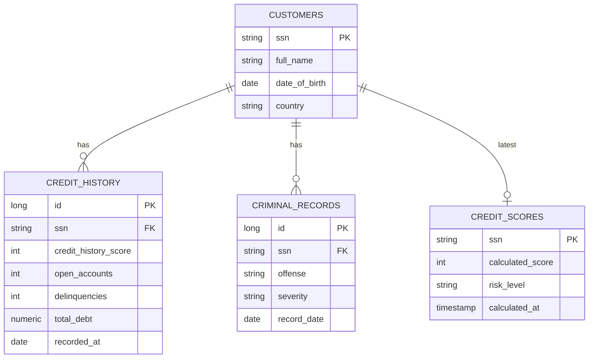

# Credit Engine v2

A Spring Boot 3.5 application that calculates customer **credit scores** from data held in
PostgreSQL (the source of truth), caches the results in **Valkey** for sub-second retrieval,
queues inbound scoring requests through **RabbitMQ**, and lets an operator query the data in
natural language through a **GenAI** assistant (Tanzu `credit-chat`).

It is deployed to **Tanzu Platform for Cloud Foundry 10.4**, where PostgreSQL, Valkey, RabbitMQ
and GenAI are bound as **service instances** in the same space (see [manifest.yml](manifest.yml)).

> This README describes the **target (refactored) architecture**. The step-by-step plan to get
> there — and the rationale behind each change — lives in [IMPLEMENTATION.md](IMPLEMENTATION.md).

---

## 1. What the application does

A web operator can:

1. **Submit** a customer's data / request a credit score (queued via RabbitMQ).
2. **Query** an existing credit score by SSN (served from the Valkey cache, falling back to Postgres).
3. Watch **performance metrics** in the page header — the headline comparison is
   *how much faster a score is retrieved from Valkey vs. PostgreSQL*.
4. See the **last 10 calculated scores** in a table at the bottom of the page, with a manual refresh.
5. Ask the **GenAI assistant** questions like *"give me the top 10 credit scores from the past 15 minutes."*
6. Open the **Admin portal** to configure cache eviction (TTL) and other runtime settings.

---

## 2. Logical architecture



### Request → score → cache flow (no distributed transaction)



The **key architectural property**: the database transaction commits *before* any non-database
resource (Valkey) is touched. Valkey is updated through an idempotent, after-commit cache-aside
write so a cache failure can never roll back — or be rolled back by — a database transaction.
This removes the distributed-transaction pattern flagged by Tanzu Hub. See
[IMPLEMENTATION.md §3](IMPLEMENTATION.md).

---

## 3. Bound services

| Service instance | Type | Role | Local (`local` profile) substitute |
|------------------|------|------|--------------------------------------|
| `credit-db`   | PostgreSQL | Source of truth — customers, credit history, criminal records, calculated scores | H2 in-memory |
| `credit-cache`| Valkey (Redis protocol) | Cache of calculated scores + a bounded "top-N" structure | In-memory map/store |
| `credit-msg`  | RabbitMQ | Queue for inbound scoring requests | Direct in-process handoff |
| `credit-chat` | GenAI (OpenAI-compatible) | Natural-language querying via Spring AI | Stubbed deterministic responder |

Service credentials are injected by Cloud Foundry through `VCAP_SERVICES` and consumed via the
`cloud` Spring profile. The `local` profile (frontend inspection only) needs **no external
services** — see [IMPLEMENTATION.md §6](IMPLEMENTATION.md).

---

## 4. Data model (PostgreSQL — source of truth)

Normalized so the credit score comes from a **real join** across several tables, matching the
brief ("criminal records, credit history, etc.").



The score is derived from credit-history signals (history score, delinquencies, debt) and
criminal-record severity, bounded to 1–100, then classified into a risk level. The full
algorithm lives in `CreditScoreCalculator`.

---

## 5. Project outline

```
credit-engine-v2/
├── pom.xml                         # Spring Boot 3.5, Java 17, Spring AI
├── manifest.yml                    # Cloud Foundry bindings (credit-db/-cache/-msg/-chat)
├── README.md                       # this file
├── IMPLEMENTATION.md               # phased refactor plan + rationale
└── src/main/
    ├── java/com/tanzu/creditengine/
    │   ├── CreditEngineV2Application.java
    │   ├── config/
    │   │   ├── RabbitMQConfig.java          # queue + JSON converter (cloud)
    │   │   ├── ValkeyConfig.java            # RedisTemplate / cache (cloud)
    │   │   └── AiConfig.java                # Spring AI ChatClient (cloud)
    │   ├── entity/                          # Customer, CreditHistory, CriminalRecord, CreditScore
    │   ├── repository/                      # JPA repositories + join query
    │   ├── cache/
    │   │   ├── CreditScoreCacheStore.java   # interface (cache-aside)
    │   │   ├── ValkeyCacheStore.java        # @Profile("cloud")
    │   │   └── InMemoryCacheStore.java      # @Profile("local")
    │   ├── messaging/
    │   │   ├── ScoreRequestPublisher.java   # interface
    │   │   ├── RabbitPublisher.java         # @Profile("cloud")
    │   │   ├── DirectPublisher.java         # @Profile("local")
    │   │   └── CreditApplicationListener.java
    │   ├── service/
    │   │   ├── CreditScoreCalculator.java   # @Transactional = Postgres only
    │   │   ├── MetricsService.java
    │   │   ├── SettingsService.java         # eviction/TTL + runtime settings
    │   │   └── CreditAiService.java         # Spring AI tool-calling
    │   ├── ai/CreditTools.java              # @Tool methods exposed to the LLM
    │   ├── controller/
    │   │   ├── CreditApplicationController.java
    │   │   ├── AdminController.java
    │   │   └── AiController.java
    │   └── bootstrap/DataLoader.java        # sample data into the normalized tables
    └── resources/
        ├── application.yml                  # default + cloud + local profiles
        └── static/
            ├── index.html                   # operator dashboard
            └── admin.html                   # admin portal
```

---

## 6. HTTP surface

| Method | Path | Description |
|--------|------|-------------|
| `POST` | `/api/apply` | Submit a scoring request (enqueued) |
| `GET`  | `/api/score/{ssn}` | Get a score (Valkey first, Postgres fallback) |
| `GET`  | `/api/scores/top` | Last 10 calculated scores (bounded, cache-backed) |
| `GET`  | `/api/metrics` | Header metrics (Postgres vs Valkey latency, cache hit rate, speedup) |
| `GET`  | `/api/latency-test/{ssn}` | One-shot Postgres-vs-Valkey latency comparison |
| `POST` | `/api/ai/query` | Natural-language query via Spring AI tool-calling |
| `GET`  | `/admin` · `GET/POST /admin/settings` | Admin portal: eviction TTL & runtime settings |
| `GET`  | `/actuator/health` | CF health check |

---

## 7. Profiles

| Profile | Activated | Backing services |
|---------|-----------|------------------|
| `cloud` | On Cloud Foundry (`SPRING_PROFILES_ACTIVE=cloud`) | Real bound `credit-db`, `credit-cache`, `credit-msg`, `credit-chat` |
| `local` | Local frontend inspection | H2 + in-memory cache + in-process queue + stub AI — **no external dependencies** |

---

## 8. Build & run

```bash
# Build (requires JDK 17; use system Maven — see AGENTS.md)
mvn -DskipTests package          # -> target/credit-engine-v2.jar

# Run locally for frontend inspection (no Docker / no services needed)
java -jar target/credit-engine-v2.jar --spring.profiles.active=local
# open http://localhost:8080

# Deploy to Tanzu Platform for Cloud Foundry
cf push   # uses manifest.yml; binds credit-db, credit-cache, credit-msg, credit-chat
```

---

## 9. Performance & scaling notes

- **Valkey vs Postgres** latency is surfaced live in the header so the cache benefit is visible.
- The cache-aside design keeps each transaction scoped to a single resource manager, so the app
  **scales horizontally** (multiple CF instances) without distributed-transaction coordination.
- CPU-spike sources identified in the original build (blocking `Thread.sleep` on listener threads,
  full-keyspace `KEYS` scans behind `findAll()`, an over-eager 5s auto-refresh) are addressed in
  [IMPLEMENTATION.md §4](IMPLEMENTATION.md).

---

## 10. Upgrading

The project targets **Spring Boot 3.5** specifically so it can be upgraded with **Spring
Application Advisor**. Keep dependencies on Spring-managed BOM versions (no hard-pinned
versions that fight the advisor) to keep the upgrade path clean.
